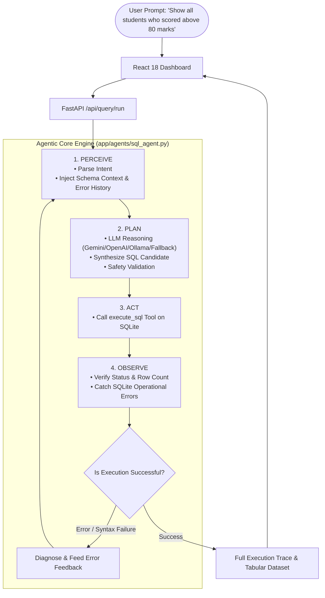

# Cycle 1 — Autonomous Self-Correcting AI SQL Agent

[](https://fastapi.tiangolo.com)
[](https://reactjs.org/)
[](https://vitejs.dev/)
[](https://www.sqlite.org/)
[](https://tailwindcss.com/)

> **Academic Track**: Agentic AI Skill-Building Assignment — Cyclic Submission Track (Cycle 1 of 6)  
> **Core Architectural Pattern**: Cognitive Loop (**Perceive → Plan → Act → Observe**) with Autonomous Self-Correction and Error Recovery.

---

## Table of Contents

1. [Requirement Analysis](#step-1--requirement-analysis)
2. [System Architecture](#step-2--system-architecture)
3. [Backend Folder Structure](#step-3--backend-folder-structure)
4. [Frontend Folder Structure](#step-4--frontend-folder-structure)
5. [Backend API Specification](#step-7--backend-api-documentation)
6. [Frontend/Backend Integration](#step-8--frontendbackend-integration)
7. [Installation Guide (Windows PowerShell)](#step-9--installation-commands)
8. [Run Commands](#step-10--run-commands)
9. [Automated Testing & Test Results](#step-11--testing)
10. [Architecture Diagrams & Data Flow](#step-13--architecture-diagram)
11. [3-5 Minute Demo Video Script](#step-14--demo-video-plan)
12. [Viva Examination Q&A (15 Questions & Answers)](#step-15--viva-preparation)

---

## STEP 1 — Requirement Analysis

### Problem Statement
Traditional Text-to-SQL systems generate queries in a single, open-loop shot without validating against the database schema, foreign keys, or syntax dialect constraints. If an error occurs (such as an invalid column name, misplaced JOIN, or data type mismatch), the user is left with a failed query.

### Agentic Solution
Cycle 1 implements a **Self-Correcting Autonomous SQL Agent** following the **Perceive → Plan → Act → Observe** agent loop:
- **Perceive**: Dynamically introspects the SQLite schema (tables, columns, types, foreign keys, sample data) and parses user natural language questions.
- **Plan**: Leverages LLM reasoning to generate an optimal SQL query matching the schema.
- **Act**: Executes the generated query using the `execute_sql` tool.
- **Observe**: Inspects execution status, caught SQLite runtime errors, and returned records.
- **Self-Correction**: If execution fails, the error message and previous query are fed back into the context, allowing the agent to diagnose the root cause and generate a corrected SQL query until success or `max_iterations` (5).

---

## STEP 2 — System Architecture



---

## STEP 3 — Backend Folder Structure

```text
cycle-1-sql-agent/backend/
├── app/
│   ├── __init__.py
│   ├── main.py                     # FastAPI entry point, CORS, lifecycle, router mounting
│   ├── config.py                   # App configuration & environment loader
│   ├── api/
│   │   ├── __init__.py
│   │   ├── endpoints.py            # REST endpoints (/api/query/run, /api/logs, /api/database/*, /api/stats)
│   │   └── schemas.py              # Pydantic models for requests/responses/traces
│   ├── agents/
│   │   ├── __init__.py
│   │   ├── sql_agent.py            # Self-correcting Perceive-Plan-Act-Observe engine
│   │   └── prompts.py              # System prompts & few-shot correction templates
│   ├── services/
│   │   ├── __init__.py
│   │   ├── database.py             # SQLite seed, query execution, schema introspection
│   │   ├── llm_service.py          # Unified LLM caller (Gemini/OpenAI/Ollama/Fallback)
│   │   └── logger_service.py       # JSON/structured in-memory & file logger
│   ├── models/
│   │   └── database_models.py      # Table schemas (Students, Courses, Grades, Departments)
│   └── utils/
│       ├── __init__.py
│       └── sql_validator.py        # SQL syntax checks, risk analyzer, sanitize
├── data/
│   └── university.db               # Pre-populated SQLite DB
├── logs/
│   └── agent.log                   # Structured runtime logs
├── tests/
│   ├── __init__.py
│   ├── test_agent.py               # Unit & integration tests for agent loop
│   └── test_api.py                 # Endpoint verification tests
├── requirements.txt
├── .env.example
└── .gitignore
```

---

## STEP 4 — Frontend Folder Structure

```text
cycle-1-sql-agent/frontend/
├── index.html
├── package.json                    # React 18, Vite, Tailwind CSS, Lucide-React, Axios
├── vite.config.js
├── tailwind.config.js
├── postcss.config.js
├── src/
│   ├── main.jsx
│   ├── App.jsx                     # Layout wrapper & client router
│   ├── index.css                   # Glassmorphism design tokens & scrollbars
│   ├── components/
│   │   ├── Navbar.jsx              # Status, backend connectivity, active model
│   │   ├── Sidebar.jsx             # Navigation (Dashboard, SQL Agent, Trace, Schema, Logs)
│   │   ├── StatusCard.jsx          # KPI metrics card
│   │   ├── LoopVisualizer.jsx      # Animated Perceive-Plan-Act-Observe pipeline
│   │   ├── TraceTimeline.jsx       # Iteration-by-iteration collapsible step inspect view
│   │   ├── SqlViewer.jsx           # Formatted SQL with copy & execute preview
│   │   ├── DataTable.jsx           # Clean table rendering query results with search/export
│   │   ├── LoadingSpinner.jsx      # Modern pulse/spinner loading state
│   │   └── LogViewer.jsx           # Live filtering backend log stream with level tags
│   ├── pages/
│   │   ├── Dashboard.jsx           # Overview, KPI cards, system status, quick prompts
│   │   ├── SqlAgentPage.jsx        # Core interactive playground with live agent loop
│   │   ├── TracePage.jsx           # Deep iteration trace history & comparison
│   │   ├── DatabasePage.jsx        # Interactive SQLite schema & sample data explorer
│   │   └── LogsPage.jsx            # Backend application log console
│   ├── services/
│   │   └── api.js                  # Axios client with base URL & response interceptors
│   └── hooks/
│       └── useAgentQuery.js        # Custom hook for query execution state
├── .env.example
└── .gitignore
```

---

## STEP 7 — Backend API Documentation

| Method | Endpoint | Description | Request Body / Parameters |
| :--- | :--- | :--- | :--- |
| `POST` | `/api/query/run` | Execute autonomous agent loop on natural language prompt | `{"question": "...", "simulate_initial_error": false, "max_iterations": 5}` |
| `GET` | `/api/query/history` | List recent agent queries and metadata | `?limit=20` |
| `GET` | `/api/query/{id}` | Get full iteration trace of a specific query | Path: `query_id` |
| `GET` | `/api/database/schema` | Complete SQLite table metadata, columns, and foreign keys | None |
| `GET` | `/api/database/tables` | Table summary counts | None |
| `POST` | `/api/database/reset` | Resets university database to default seed state | None |
| `GET` | `/api/logs` | Real-time structured log events | `?limit=100&level=ALL` |
| `GET` | `/api/stats` | Dashboard KPIs (queries, success count, avg iterations) | None |
| `GET` | `/health` | System health check | None |

---

## STEP 9 — Installation Commands

Run the following in **Windows PowerShell**:

```powershell
# 1. Navigate to Cycle 1 Backend
cd "cycle-1-sql-agent\backend"

# 2. Create virtual environment and install dependencies
uv venv
.\.venv\Scripts\Activate
uv pip install -r requirements.txt

# 3. Setup Frontend
cd "..\frontend"
npm install
```

---

## STEP 10 — Run Commands

### Terminal 1: Backend Server

```powershell
cd "cycle-1-sql-agent\backend"
.\.venv\Scripts\Activate
uvicorn app.main:app --reload --host 127.0.0.1 --port 8000
```
> Server runs at `http://127.0.0.1:8000` (Swagger UI at `/docs`)

### Terminal 2: Frontend Server

```powershell
cd "cycle-1-sql-agent\frontend"
npm run dev
```
> Dashboard runs at `http://localhost:5173`

---

## STEP 11 — Testing

Run the automated test suite in backend:

```powershell
cd "cycle-1-sql-agent\backend"
.\.venv\Scripts\Activate
pytest -v
```

### Automated Test Cases Included:
1. **`test_database_schema_introspection`**: Verifies schema inspection of `students`, `professors`, `departments`, `courses`, `enrollments`.
2. **`test_sql_execution_success`**: Tests safe query execution tool.
3. **`test_sql_execution_error_capture`**: Confirms SQLite errors are caught as structured objects.
4. **`test_sql_safety_validator`**: Validates blocking destructive keywords (`DROP`, `TRUNCATE`).
5. **`test_agent_single_iteration_success`**: Validates single-turn query synthesis and execution.
6. **`test_agent_self_correction_recovery`**: Simulates an initial typo in iteration 1, verifies the agent catches the error in `OBSERVE` and self-corrects in iteration 2.
7. **`test_health_endpoint`**, **`test_stats_endpoint`**, **`test_run_query_endpoint`**, **`test_logs_endpoint`**: FastAPI HTTP route integration tests.

---

## STEP 13 — Architecture Diagram

```mermaid
sequenceDiagram
    autonumber
    actor User as Student / Evaluator
    participant UI as React Frontend
    participant API as FastAPI Backend
    participant Agent as SQLSelfCorrectingAgent
    participant LLM as LLM Engine
    participant DB as SQLite DB

    User->>UI: Types "Show all students who scored above 80 marks"
    UI->>API: POST /api/query/run
    API->>Agent: agent.run(question)
    
    rect rgb(20, 25, 45)
    note right of Agent: Iteration 1: Perceive -> Plan -> Act -> Observe
    Agent->>DB: get_database_schema()
    DB-->>Agent: Schema Metadata (tables, columns, foreign keys)
    Agent->>LLM: generate_plan_and_sql(prompt, schema)
    LLM-->>Agent: Plan + Candidate SQL
    Agent->>DB: execute_sql(candidate_sql)
    DB-->>Agent: Execution Result / Caught SQLite Error
    Agent->>Agent: Observe outcome
    end

    alt If Operational Error Caught (Self-Correction Triggered)
    rect rgb(45, 30, 20)
    note right of Agent: Iteration 2: Diagnose & Self-Correct
    Agent->>LLM: generate_plan_and_sql(prompt + previous_error + previous_sql)
    LLM-->>Agent: Corrected Plan + Revised SQL
    Agent->>DB: execute_sql(corrected_sql)
    DB-->>Agent: Clean result rows (Success)
    Agent->>Agent: Observe outcome (PASS)
    end
    end

    Agent-->>API: Full Trace (Iterations 1..N, SQL, Rows, Latency)
    API-->>UI: 200 OK Response
    UI->>User: Displays animated pipeline, results table & iteration comparison
```



---

## STEP 14 — Demo Video Plan (3–5 Minutes)

- **0:00 - 0:45 | Introduction & Overview**:
  - Introduce Cycle 1: AI Self-Correcting SQL Agent.
  - Explain the core architecture: **Perceive → Plan → Act → Observe**.
  - Show the Dashboard with real-time KPI metrics and table summaries.
- **0:45 - 1:45 | Standard Query Execution**:
  - Open the **SQL Agent Loop** page.
  - Enter the prompt: *"Show all students who scored above 80 marks"*.
  - Show the live step transitions in `LoopVisualizer`.
  - Highlight the generated SQL with JOINs across `students`, `enrollments`, and `courses`.
  - Inspect the resulting Data Table.
- **1:45 - 3:00 | Live Self-Correction Demonstration (Crucial for Viva)**:
  - Toggle **"Self-Correction Demo Mode"** on the UI.
  - Execute the query.
  - Show that Iteration 1 failed due to a simulated column typo caught in `OBSERVE`.
  - Show Iteration 2 where the agent diagnosed the error, revised the plan, generated valid SQL, and recovered automatically.
  - Switch between Iteration 1 and Iteration 2 tabs.
- **3:00 - 3:45 | Trace & Database Inspection**:
  - Navigate to **Iteration Trace** to review the full timeline and duration metrics.
  - Navigate to **Database Schema** to inspect foreign keys and live SQLite records.
  - Show the **Agent Logs** console streaming JSON logs.
- **3:45 - 4:15 | Code Walkthrough & Conclusion**:
  - Highlight `app/agents/sql_agent.py` and `app/services/database.py`.
  - Summarize achievements and conclude.

---

## STEP 15 — Viva Preparation (15 Questions & Answers)

### Q1: What is the core difference between a standard LLM prompt and an Agent Loop?
> **Answer**: A standard prompt is open-loop (one-shot generation with no environment interaction or error feedback). An Agent Loop is closed-loop: it perceives the environment, plans actions, acts by calling tools, observes results/errors, and iterates until the goal is achieved or a guardrail stops it.

### Q2: What are the 4 stages of the cognitive loop implemented in Cycle 1?
> **Answer**:
> 1. **Perceive**: Gathers environment state (database schema, foreign keys, user request).
> 2. **Plan**: LLM reasoning synthesizes the execution strategy and SQL query.
> 3. **Act**: Executes tools (`execute_sql`, `get_database_schema`).
> 4. **Observe**: Evaluates return values, validates row counts, and detects errors for self-correction.

### Q3: How does the agent self-correct when an invalid SQL query is generated?
> **Answer**: In the **Observe** phase, if `execute_sql` returns a SQLite syntax or operational error, the agent stores the error description and previous SQL. In the next iteration, these are injected into `SELF_CORRECTION_PROMPT_TEMPLATE`. The LLM diagnoses the mistake and outputs an amended query.

### Q4: Why is schema introspection essential for the Perceive phase?
> **Answer**: Without schema introspection, the LLM hallucinates table names and column names. Providing table definitions, data types, and foreign key relationships allows the agent to construct valid relational JOINs.

### Q5: What guardrails are implemented against infinite agent loops?
> **Answer**: The agent enforces a strict `MAX_ITERATIONS` limit (configured in `.env`, default 5). If the agent fails to produce a valid query within 5 iterations, it terminates gracefully with a `FAILED` status and full error logs.

### Q6: How does the backend prevent destructive SQL execution?
> **Answer**: The `SQLValidator` utility analyzes the SQL string for high-risk destructive keywords (`DROP`, `TRUNCATE`, `ALTER`, `GRANT`, `REVOKE`) and blocks execution before sending it to SQLite.

### Q7: What tools are implemented in this project?
> **Answer**:
> 1. `get_database_schema`: Introspects tables, columns, primary keys, foreign keys, and sample rows.
> 2. `execute_sql`: Executes sanitized SQLite queries and returns columns, rows, execution time, and operational errors.

### Q8: What database engine is used and how is it seeded?
> **Answer**: SQLite 3 with a normalized university schema (`departments`, `professors`, `students`, `courses`, `enrollments`) pre-seeded on startup in `app/services/database.py`.

### Q9: How does the application work if no external LLM API key is provided?
> **Answer**: `llm_service.py` features a multi-provider fallback hierarchy (`Gemini` ➔ `OpenAI` ➔ `Groq` ➔ `Ollama` ➔ `Intelligent Semantic Engine`). If no API key is provided, the local heuristic engine synthesizes valid queries and supports simulated self-correction for offline evaluation.

### Q10: How does the React frontend maintain real-time status during execution?
> **Answer**: The custom `useAgentQuery` hook manages lifecycle state progression (`PERCEIVE` ➔ `PLAN` ➔ `ACT` ➔ `OBSERVE` ➔ `DONE`) and updates `LoopVisualizer` with animated status badges and active iteration counters.

### Q11: How is the execution trace structured?
> **Answer**: Each step contains `iteration`, `timestamp`, `duration_ms`, `status`, and four JSON payloads for `perceive`, `plan`, `act`, and `observe`, allowing deep chronological inspection.

### Q12: Why is SQLite's `row_factory = sqlite3.Row` used?
> **Answer**: It allows SQLite results to be converted into dictionaries with column names as keys, enabling serialization to JSON for the React `DataTable` component.

### Q13: What logging mechanism is implemented?
> **Answer**: Python's `logging` module configured with a JSON `FileHandler` for disk persistence, a console handler, and an in-memory ring buffer (`deque(maxlen=200)`) consumed by the `/api/logs` endpoint.

### Q14: How does CORS work between the Vite frontend and FastAPI backend?
> **Answer**: FastAPI includes `CORSMiddleware` configured with `allow_origins=["*"]`, `allow_methods=["*"]`, and `allow_headers=["*"]`, allowing Vite on port 5173 to communicate with FastAPI on port 8000.

### Q15: How can this agent architecture be extended to multi-agent systems?
> **Answer**: The modular tool-execution and state-passing patterns in Cycle 1 serve as the foundation for Cycle 3 (LangGraph multi-agent orchestration) and Cycle 4 (A2A protocol agent federation).
